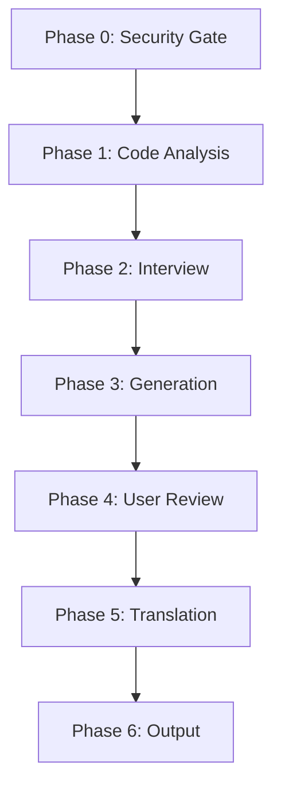

# GitHub README Skill

<div align="center">


</div>

A Claude Code skill that generates high-quality, well-structured README.md files for GitHub repositories. Dual-engine approach combining code analysis (ground truth) with user interviews (user intent) ensures READMEs are both accurate and well-narrated.

## Table of Contents

- [Features](#features)
- [Installation](#installation)
- [Usage](#usage)
- [Modes](#modes)
- [Pipeline](#pipeline)
- [Configuration](#configuration)
- [Contributing](#contributing)
- [License](#license)

## Features

- **Dual-Engine Generation**: Code analysis establishes ground truth; user interviews capture project narrative
- **Two Execution Modes**: Interview mode (full pipeline) and Direct mode (auto-generate)
- **Multilingual Support**: Generate READMEs in Chinese, English, Japanese, Korean, French, German, and more
- **Checkpoint & Resume**: Automatic checkpoint files enable interruption recovery
- **GitHub Extended Syntax**: Badges, alerts, collapsed sections, tables, anchor links, task lists, and Mermaid diagrams
- **Cross-Validation**: Technical claims (API signatures, config keys, CLI commands) verified against source code
- **Security-First**: Automatic exclusion of secrets, credentials, and sensitive files

## Installation

### As a Claude Code Plugin

Install via the plugin marketplace:

```bash
/plugin marketplace add Ricardo-Nima/github-readme-skill
/plugin install readme@github-readme-skills
```

## Usage

### Quick Start

Generate a README with the full interactive interview:

```
/readme
```

### Direct Mode (Auto-Generate)

Skip the interview and auto-generate from code analysis:

```
/readme --mode direct
```

Generate with specific languages:

```
/readme --mode direct --lang zh,en
```

<details>
<summary>Full Command Reference</summary>

| Command | Description |
|---------|-------------|
| `/readme` | Start interview mode (default) |
| `/readme --mode direct` | Auto-generate without interview |
| `/readme --mode direct --lang zh,en,ja` | Direct mode with multi-language output |
| `/readme --mode interview --lang zh,en` | Interview mode with specified languages |
| `/readme --force` | Force regeneration, ignoring existing README |

</details>

## Modes

### Interview Mode (Default)

The full 6-phase pipeline with user interaction:

1. **Phase 0** — Security gate + existing README analysis
2. **Phase 1** — Code analysis (extracts tech stack, APIs, configs)
3. **Phase 2** — Bidirectional interview with Gap Check (verifies user claims against code)
4. **Phase 3** — README generation + cross-validation
5. **Phase 4** — User review gate
6. **Phase 5** — Multilingual translation
7. **Phase 6** — Final output + cleanup

### Direct Mode

Skips Phase 2 interview, auto-infers project narrative from code:

- Project description from package manifest
- Installation commands from detected package manager
- Usage examples from API signatures
- Single-language output (unless `--lang` specified)

| Feature | Interview Mode | Direct Mode |
|---------|---------------|-------------|
| User interview | Required | Skipped |
| Code analysis | Full | Full |
| Gap Check | Yes | N/A |
| Translation | Yes | By request |
| Speed | Slower | Faster |
| Accuracy | Higher | Good |

## Pipeline



<!-- Experimental: if rendering fails, preview on GitHub -->

## Configuration

The skill is configured via `.claude-plugin/plugin.json`:

| Key | Type | Description |
|-----|------|-------------|
| `name` | string | Plugin identifier |
| `version` | string | Semantic version |
| `description` | string | Plugin description |
| `author` | string | Plugin author |
| `license` | string | License identifier |
| `skills` | array | Skill directory paths |
| `keywords` | array | Search keywords |

> [!IMPORTANT]
> All configuration values that contain secrets (API keys, tokens, passwords) must use placeholder values like `<YOUR_API_KEY>`.

## Contributing

Contributions are welcome. Please:

1. Fork the repository
2. Create a feature branch (`git checkout -b feature/amazing-feature`)
3. Make your changes
4. Run validation if available
5. Commit your changes (`git commit -m 'feat: add amazing feature'`)
6. Push to the branch (`git push origin feature/amazing-feature`)
7. Open a Pull Request

## License

This project is licensed under the MIT License — see the [LICENSE](LICENSE) file for details.
