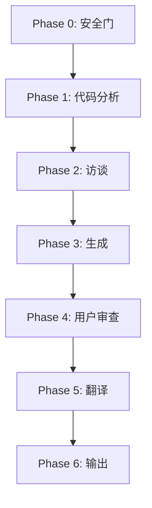

# GitHub README 技能

<div align="center">


</div>

一个为 GitHub 仓库生成高质量、结构完整 README.md 文件的 Claude Code 技能。采用代码分析（底层事实）与用户访谈（项目叙事）双引擎驱动，确保 README 既准确反映代码实际，又传达项目的正确叙事。

## 目录

- [功能特性](#功能特性)
- [安装](#安装)
- [使用](#使用)
- [执行模式](#执行模式)
- [流水线](#流水线)
- [配置](#配置)
- [贡献](#贡献)
- [许可证](#许可证)

## 功能特性

- **双引擎生成**：代码分析建立底层事实，用户访谈捕捉项目叙事
- **两种执行模式**：访谈模式（完整流水线）和直接模式（自动生成）
- **多语言支持**：支持中文、英文、日文、韩文、法文、德文等多种语言
- **断点续传**：自动生成检查点文件，支持中断后恢复
- **GitHub 扩展语法**：徽章、告示块、折叠区域、表格、锚点链接、任务列表、Mermaid 图表
- **交叉验证**：技术声明（API 签名、配置键、CLI 命令）与源码逐项核对
- **安全优先**：自动排除密钥、凭证和敏感文件

## 安装

### 作为 Claude Code 插件安装

通过插件市场安装：

```bash
/plugin marketplace add Ricardo-Nima/github-readme-skill
/plugin install github-readme@github-readme-skills
```

## 使用

### 快速开始

通过完整的交互式访谈生成 README：

```
/readme
```

### 直接模式（自动生成）

跳过访谈，从代码自动推断生成：

```
/readme --mode direct
```

指定语言生成：

```
/readme --mode direct --lang zh,en
```

<details>
<summary>完整命令参考</summary>

| 命令 | 说明 |
|------|------|
| `/readme` | 启动访谈模式（默认） |
| `/readme --mode direct` | 跳过访谈自动生成 |
| `/readme --mode direct --lang zh,en,ja` | 直接模式 + 多语言输出 |
| `/readme --mode interview --lang zh,en` | 访谈模式 + 指定语言 |
| `/readme --force` | 强制重新生成，忽略已有 README |

</details>

## 执行模式

### 访谈模式（默认）

完整的 6 阶段流水线，包含用户交互：

1. **Phase 0** — 安全门 + 现有 README 分析
2. **Phase 1** — 代码分析（提取技术栈、API、配置）
3. **Phase 2** — 双向访谈 + 差距检查（验证用户声称与代码事实一致性）
4. **Phase 3** — README 生成 + 交叉验证
5. **Phase 4** — 用户审查门
6. **Phase 5** — 多语言翻译
7. **Phase 6** — 最终输出 + 清理

### 直接模式

跳过 Phase 2 访谈，从代码自动推断项目叙事：

- 从包清单中提取项目描述
- 根据检测到的包管理器生成安装命令
- 从 API 签名生成使用示例
- 默认单语言输出（除非指定 `--lang`）

| 特性 | 访谈模式 | 直接模式 |
|------|---------|---------|
| 用户访谈 | 需要 | 跳过 |
| 代码分析 | 完整 | 完整 |
| 差距检查 | 是 | 不适用 |
| 翻译 | 是 | 按需 |
| 速度 | 较慢 | 较快 |
| 准确性 | 更高 | 良好 |

## 流水线



<!-- 实验性：如果渲染异常请在 GitHub 上预览 -->

## 配置

技能通过 `.claude-plugin/plugin.json` 配置：

| 键 | 类型 | 说明 |
|-----|------|------|
| `name` | string | 插件标识符 |
| `version` | string | 语义版本号 |
| `description` | string | 插件描述 |
| `author` | string | 插件作者 |
| `license` | string | 许可证标识 |
| `skills` | array | 技能目录路径 |
| `keywords` | array | 搜索关键词 |

> [!IMPORTANT]
> 所有包含密钥的配置值（API 密钥、令牌、密码）必须使用占位符，如 `<YOUR_API_KEY>`。

## 贡献

欢迎贡献代码。请遵循以下步骤：

1. Fork 本仓库
2. 创建特性分支 (`git checkout -b feature/amazing-feature`)
3. 进行修改
4. 运行验证（如可用）
5. 提交更改 (`git commit -m 'feat: add amazing feature'`)
6. 推送到分支 (`git push origin feature/amazing-feature`)
7. 创建 Pull Request

## 许可证

本项目基于 MIT 许可证开源 — 详见 [LICENSE](LICENSE) 文件。
